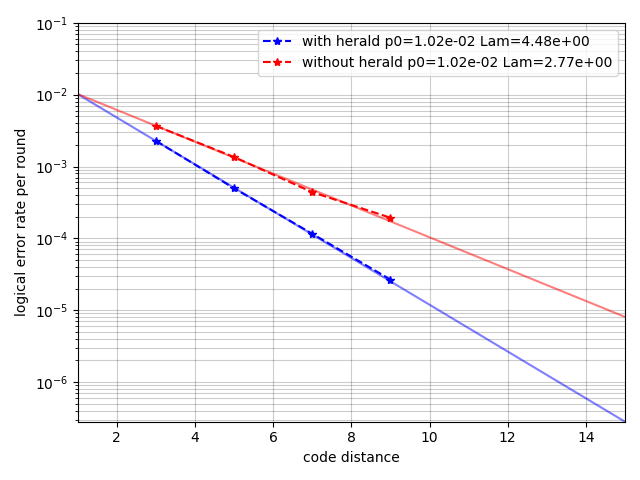
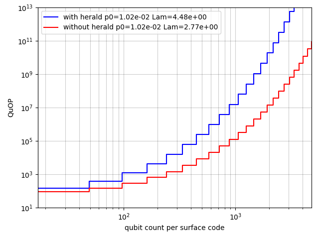

# Evaluate heralded error improvement

This software will simulate circuit-level surface codes, where each CX gate is assumed to be verified with additional measuremnts.

We provide three parameters for CX gates as follows
- `herald_rate`: heralding probability.
- `error_rate_heralded`: depolarizing rate when herlading signal is observed
- `error_rate_unheralded`: depolarizing rate when heralding signal is not observed

The evaluation of logical error rates are performed as follows.

1. Determine whether each CX gate is helraded or not for every shot.
2. Create Noisy quantum circuits are created where its error rate is determined according to heralded signals.
3. Sample a single shot from the circuit.
4. Estimate logical observable flip using the heralded signals (i.e., compiling DEM from the sampled circuit)
5. Estimate logical observable flip without using the heralded signals (i.e., DEM is compiled from circuits assuming averaged error rates)

To avoid compling the same noisy circuits to DEM multiple times, we bundle error etimations for the same pattern of heralding signals. This significantly reduces the calculation time when a heralding rate is small compared to the number of CXs.


## `run.py`
Evaluate the count of logical errors with and without using heralding signals in error estimation for several code distances. The configuration of simulation setting is as follows.
```python
config = SimulationConfig(
    num_sample=100000,
    distance=5,
    rounds=5,
    basis="z",
    herald_rate=0.01,
    error_rate_heralded=0.5,
    error_rate_unheralded=0.001,
    error_before_measurement=0.001,
    error_after_measurement=0.001,
    before_round_data_depolarization=0.001,
    num_workers=8,
    seed=42,
)
```

## `plot.py`
Plot logical error rates to code distance per round. Also, we fit the function with `p_L = a * Lambda^{-(d-1)/2}` and extrapolate logical error lines to estimate required number of physical qubits.




