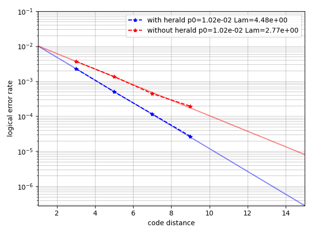

# Evaluate heralded error improvement

This software will simulate circuit-level surface codes, where each CX gate is assumed to be verified with additional measuremnts.

We provide three parameters for CX gates as follows
- `herald_rate`: heralding probability.
- `error_rate_with_herald`: depolarizing rate when herlading signal is observed
- `error_rate_without_herald`: depolarizing rate when heralding signal is not observed

The evaluation of logical error rates are performed as follows.

1. Determine whether each CX gate is helraded or not for every shot.
2. Create Noisy quantum circuits are created where its error rate is determined according to heralded signals.
3. Sample a single shot from the circuit.
4. Estimate logical observable flip using the heralded signals (i.e., compiling DEM from the sampled circuit)
5. Estimate logical observable flip without using the heralded signals (i.e., DEM is compiled from circuits assuming averaged error rates)

The configuration of simulation setting is as follows.
```python
config = SimulationConfig(
    num_sample=N,
    distance=d,
    rounds=d,
    basis=basis,
    herald_rate=p_herald,
    error_rate_with_herald=p_error_with_herald,
    error_rate_without_herald=p_error_without_herald,
    error_before_measurement=p_meas / 2,
    error_after_measurement=p_meas / 2,
    before_round_data_depolarization=p_idle,
    num_workers=num_worker,
    seed=seed,
)
```

Plot of logical error rates to code distance with analysis of Lambda.



